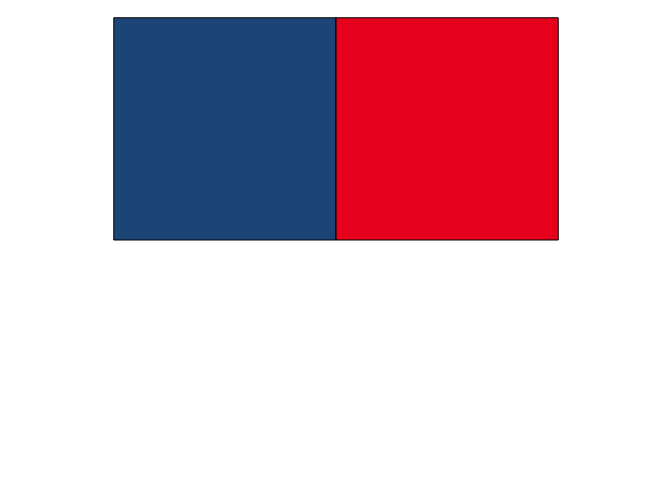

<!-- README.md is generated from README.Rmd. Please edit that file -->

# paintR

<!-- badges: start -->

[](https://github.com/nathansam/paintR/actions)
<!-- badges: end -->

paintR provides a collection of R colour palettes I frequently like to
use in my work.

## Installation

You can install the development version of paintR from
[GitHub](https://github.com/) with:

``` r
# install.packages("devtools")
devtools::install_github("nathansam/paintR")
```

## Getting started

``` r
library(paintR)
```

At present, paintR only supports discrete colour palettes. These
palettes are provided via the `paintR_cols()` function with the name of
the palette passed as an argument.

``` r
paintR_cols("union")
#> [1] "#235789" "#ed1c24"
```

## Palettes

This section presents a list of the palettes provided by paintR
alongside short descriptions.

### Union

Inspired by red white and blue flags but does not use exact hex values
from any flag in particular. This colour palette looks great against a
white background such as when `ggplot2::theme_minimal()` is used.
However, this palette only consists of two colours and is therefore
limited to binary cases.



### Pastel

A palette of 5 pastel colours.


